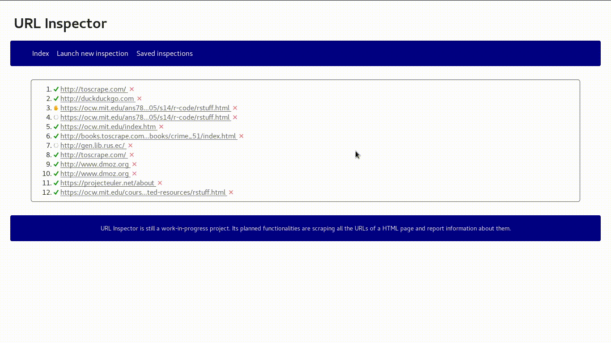

# URL Inspector

**URL Inspector** is still a work-in-progress project in its early commits. Its planned functionalities are scraping all
the hypertextual references inside a HTML page and report information about them. It is built using Django with Scrapy
integrated in it.

## Animated previews
You can also have a [fuller preview](./previews/preview.webm).

## External software
**URL Inspector** was built thanks to:
* [Django framework](https://www.djangoproject.com/), *a high-level Python Web framework that encourages rapid
development and clean, pragmatic design.*
* [Scrapy](https://scrapy.org/), *an open source and collaborative framework for extracting the data you need from
websites.*
* [Scrapyd](https://scrapyd.readthedocs.io/en/stable/), *an application for deploying and running Scrapy spiders.*
* [python-scrapyd-api](https://pypi.python.org/pypi/python-scrapyd-api), *a Python wrapper for working with the Scrapyd
API.*
